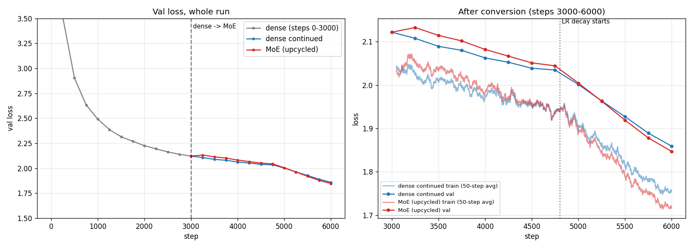
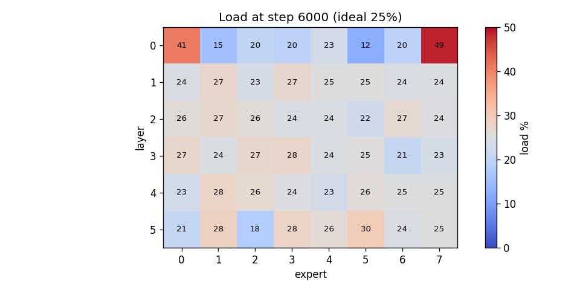
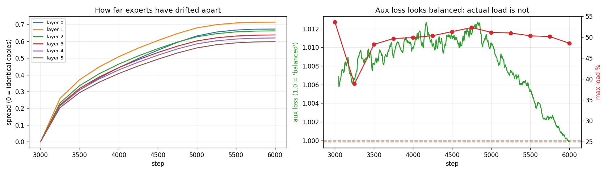
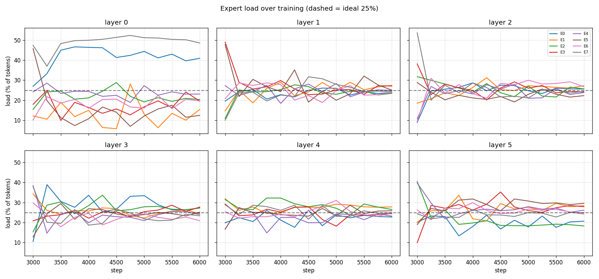

# Dense → Mixture-of-Experts: upcycling a small GPT and continuing training

**Assignment:** train a dense ("linear") model, convert it into a Mixture-of-Experts (MoE), and show that it continues to train and reduce loss. Model size and data were left to us.

**Short answer:** a 30M-parameter dense GPT was trained for 3,000 steps on TinyStories, then converted into an 8-expert, top-2 MoE. At the conversion point the MoE's val loss was the same as the dense model's (difference 1.7e-6). It then trained for 3,000 more steps, and val loss fell from **2.1217 to 1.8471**. A dense control, continued over the same steps, reached 1.8592.

All numbers below come from the notebook's actual outputs. Hardware: one Kaggle T4. Total GPU time was about 45 minutes.

---

## Results at a glance

|                              | Dense (control) | MoE (upcycled) |
|------------------------------|----------------:|---------------:|
| Total parameters             | 30.02M          | 79.58M         |
| Active parameters per token  | 30.02M          | 37.12M         |
| Val loss at conversion (step 3000) | 2.1217    | 2.1217         |
| Val loss at end (step 6000)  | 1.8592          | 1.8471         |
| Drop after conversion        | 0.263           | 0.275          |
| Time per step (T4)           | 0.24 s          | 0.34 s         |

---

## Setup

**Data.** TinyStories ([roneneldan/TinyStories](https://huggingface.co/datasets/roneneldan/TinyStories)), short synthetic children's stories, tokenized with the GPT-2 tokenizer (tiktoken). Stories are separated by an end-of-text token.
- Train: 30M tokens, the first 135,157 stories of the train split, streamed in order rather than randomly sampled.
- Val: 1M tokens from the dataset's separate validation split, so train and val don't overlap.
- Every evaluation uses the **same 40 fixed val batches** (about 328k tokens). This makes losses directly comparable across models and steps.

**Dense model.** A shrunk nanoGPT-style decoder:
- 6 layers, width 384, 6 heads, context 256.
- RMSNorm, learned position embeddings, input and output embeddings tied.
- FFN is SwiGLU with three matrices (gate, up, down) and an inner width of 1024.
- Parameters: 30.02M total, 10.62M non-embedding, 7.08M of that in the FFNs.

**Training.**
- AdamW with betas (0.9, 0.95). Weight decay 0.1 on matrices only.
- Gradient clipping at 1.0. fp16 autocast with GradScaler.
- Batch of 32 × 256 = 8,192 tokens per step.
- One warmup-stable-decay (WSD) LR schedule planned for the **whole 6,000-step experiment**:
  - Warmup over 200 steps to 1e-3.
  - Flat until step 4,800.
  - Linear decay to 1e-4 at step 6,000.
- The conversion happens at step 3,000, in the flat part of the schedule. So the LR doesn't change at the handoff, and any loss change there comes from the conversion alone. A cosine schedule would have decayed close to its minimum by step 3,000, and continued training would then have needed the LR pushed back up.

**Conversion (sparse upcycling).** In every layer, the FFN is replaced by a router plus 8 experts:
- Each expert is an **exact copy** of that layer's trained dense FFN.
- The router is a 384 × 8 matrix, initialized with small random weights (std 0.02, fixed seed).
- Each token goes to its top-2 experts. The two router weights are renormalized to sum to 1, and the output is their weighted sum, y = Σ gᵢ Eᵢ(x).
- No shared expert, no capacity limit (no token dropping), and all 6 layers are converted.
- Load-balancing loss: Switch-style, N · Σₑ fₑ · Pₑ, where fₑ is the share of routing slots that go to expert e and Pₑ is its mean router probability. Coefficient 0.01.
- **Optimizer state carries over.** Each expert inherits its dense FFN's Adam state (both moments and the step count). The router starts with fresh state. The dense control simply keeps its own optimizer state.

---

## Checking the conversion

Because every expert is identical and the chosen weights sum to 1, the MoE should compute exactly what the dense model computes. Three checks confirm this:

| Check | Result |
|---|---|
| 1. Each MoE layer vs its dense FFN on random input (fp32), max absolute difference | 3.1e-6 to 5.7e-6 across the 6 layers |
| 2. Val loss of the dense model vs the converted MoE | 2.12171 vs 2.12171 (difference 1.7e-6) |
| 3. Router gradient norm from the main loss vs from the load-balancing loss | 6.0e-8 vs 5.64 |

**Check 3 shows a subtle point about upcycling.** With identical experts, the router's choice doesn't change the output, so the main loss gives the router **no gradient at all**. Without the load-balancing loss, the router would initially receive no learning signal from the main loss. Once the experts receive different tokens, they diverge, and the main loss starts to give the router a gradient.

At conversion, the random router split tokens unevenly: per-expert load ranged from 8.6% to 54.5%, against an ideal of 2/8 = 25%.

---

## Continued training

Both branches start from the same step-3000 checkpoint. They use the same LR schedule, the same training batches (same seed) and the same val batches. The only difference is the architecture.

**The MoE keeps training.** Its val loss fell steadily from 2.1217 to 1.8471. There was no jump at the conversion.

**It first fell slightly behind, then caught up.** At step 3,250 the MoE's val loss had risen to 2.1325, while the dense model's had fallen to 2.1076. The MoE trailed until the two were level at step 5,250 (1.9629 vs 1.9635), and finished ahead (1.8471 vs 1.8592). A likely explanation, not tested here:
- Each expert sees only part of the tokens, so its gradients are noisier.
- Adam rescales updates to full size regardless, so the experts drift apart quickly at first. Spread was already 0.22 by step 3,250.
- This drift costs a little loss before it starts to help.

**On the comparison with dense: "on par, slightly ahead," not "MoE is better."**
- The final val gap is 0.012, from a single seed.
- Top-2 routing means each token passes through two FFN copies. The MoE therefore does about twice the FFN compute per token, so this is not a compute-matched comparison.
- On *train* loss (mean of the last 50 steps), the MoE's lead is three times larger: 0.037 (1.7161 vs 1.7534), against 0.012 on val. Its extra parameters help it fit the training data more than they help on unseen data. See the caveat on repeated data below.

---

## Routing diagnostics

Per-layer load at step 6000 (ideal 25%):

| Layer | Max % | Min % | Max / ideal | Experts < 10% | Spread |
|---:|---:|---:|---:|---:|---:|
| 0 | 48.6 | 12.5 | 1.94 | 0 | 0.673 |
| 1 | 27.4 | 23.4 | 1.10 | 0 | 0.714 |
| 2 | 27.3 | 22.3 | 1.09 | 0 | 0.662 |
| 3 | 27.7 | 20.9 | 1.11 | 0 | 0.638 |
| 4 | 27.8 | 22.8 | 1.11 | 0 | 0.620 |
| 5 | 29.6 | 18.3 | 1.18 | 0 | 0.598 |

**Layers 1–5 balanced well; layer 0 did not.** In layers 1–5, every expert ends with between 18% and 30% of tokens. In layer 0, two experts take 41% and 49% of tokens and one gets 12%. This matches a point from the session: some MoE models keep their first one to three layers dense, because routing in the first layer settles more slowly. A plausible reason is that layer 0 sees almost raw token embeddings with little context, so tokens tend to be grouped by identity, and frequent tokens pile onto a few experts. No expert in any layer was close to unused; all are at 12% or more.

**The load-balancing loss didn't detect the problem.** Averaged over layers, it stayed between 0.999 and 1.013 for the whole run, which looks perfectly balanced. Yet layer 0's maximum load stayed near 50%. The reason: this loss multiplies the routing share by the *mean router probability*, so it reaches about 1.0 whenever the mean probabilities are uniform, even if the actual top-2 picks are lopsided. The per-expert load is the more reliable signal.

**The experts did diverge.** Spread is the mean distance of each expert from the layer's average expert, relative to that average; 0 means identical copies. It grew from 0 to between 0.60 and 0.71 in every layer. It is highest in layer 1 and decreases with depth. Spread measures how far the experts have *diverged*; it doesn't by itself show what, if anything, they have *specialized* in.

---

## Caveats

- **One seed.** The 0.012 val difference between the MoE and dense could be within seed-to-seed variation.
- **Not compute-matched.** Top-2 routing gives the MoE about 2× the FFN compute per token. It ran 1.4× slower per step, with a naive per-expert loop.
- **Repeated data.** 6,000 steps × 8,192 tokens is about 49M tokens drawn from a 30M-token subset, about 1.6 passes. The gap between val loss and train loss (train averaged over the last 50 steps) grows from 0.076 at step 3,000, before a full pass over the data, to 0.106 for dense and 0.131 for the MoE at step 6,000. The comparison stays fair because both branches see identical batches, but absolute train losses after about step 3,700 partly reflect repeated data. The MoE's larger gap is consistent with its extra capacity fitting the repeated data.
- **Easy dataset.** TinyStories has a narrow vocabulary and simple structure. These loss values can't be compared with loss on general-purpose text benchmarks.

## Deliberately out of scope

- **Capacity limits / token dropping, expert parallelism, all-to-all:** not applicable on one GPU with a naive per-expert loop. No tokens are dropped.
- **MoE trained from scratch:** not run.
- **Alternatives not tried:** keeping layer 0 dense, a stronger load-balancing coefficient, fine-grained upcycling (splitting the FFN into smaller experts instead of copying it).

---

## Reproducing

Everything runs on the Kaggle free tier with one T4 GPU.

| Stage | What | Runtime |
|---|---|---|
| 0 | Tokenize TinyStories into `train.bin` (30M tokens) and `val.bin` (1M tokens), on CPU | ~5–10 min |
| 1 | Dense baseline, steps 0 → 3000, saves a checkpoint | ~12 min |
| 2 | Convert to MoE, run the three equivalence checks | seconds |
| 3 | Continue the MoE and dense branches, steps 3000 → 6000 | ~17 + 12 min |
| 4 | Routing diagnostics from the logs (plots only) | seconds |

Outputs: `dense_step3000.pt`, `moe_step3000.pt`, `moe_step6000.pt`, `log_dense.json`, `log_moe.json`, `log_dense_cont.json`, and the four figures above.
